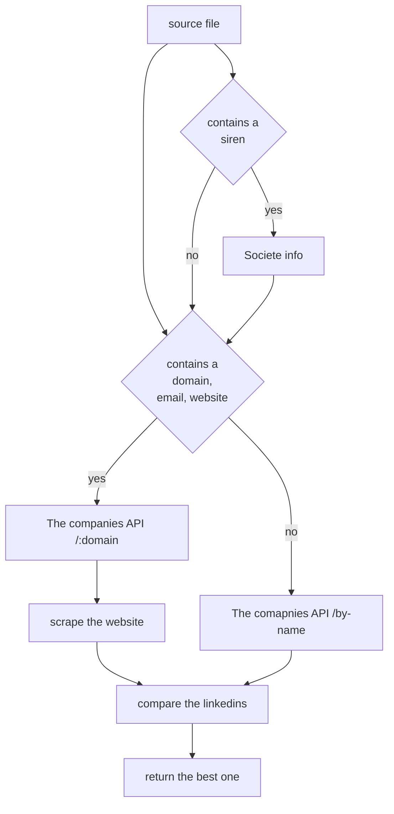

# POC Import Entreprises

- [`The Companies API`](https://www.thecompaniesapi.com/)
- [`Clearbit API`](https://dashboard.clearbit.com/docs)
- [`Societe Info`](https://societeinfo.com/)
- [`Coresignal`](https://coresignal.com/)

## I. ) The Companies API

- [`notebook 1`](./benchmark.ipynb)
- [`notebook 2`](./from_domain.ipynb)
- [`test sample 1`](./samples/samples.parquet)
- [`test sample 2`](./samples/samples_aprex.csv)
- [`results by name`](./results/tcapi_name.parquet)
- [`results by domain`](./results/tcapi_domain.parquet)
- [`results from domain`](./results/tcapi_aprex.csv)

### Functionalities

- +54 million companies
- Search for a company by its **name** (0.25 credit) (get social networks, email patterns, basic info, ...)
- Search for a company by its **domain name** (1 credit)
- Search for a company using filters, industries, country, ... (**not via the API**)
- Search for employees (get email, position, linkedin,...)

### Pricing

**Monthly subscription**
| Price | Credits |
| --- | --- |
| $0 | 500 |
| $95 | 100k |
| $295 | 500k |
| $595 | 1m |

**Yearly subscription**
| Price | Credits |
| --- | --- |
| $0 | 500 |
| $79 | 100k |
| $245 | 500k |
| $495 | 1m |

### Test using the user inputed name

#### Process

1. We take a sample of 200 companies with their linkedin account (`linkedin_url`) and the name entered by the user (`input_name`) (it might not be the same as the one on linkedin)
2. We loop through each `input_name` and send a request to *The Companies API* to find a company by it's name
3. From there we can get (or not) a `linkedinIdAlpha`
4. Since we might get multiple companies and therefore multiple `linkedinIdAlpha`, we try to find the best one by transforming the `input_name` into a url like format and check if it is in the list otherwise we take the first one
5. Compare the retrieved `linkedinIdAlpha` with the one from the dataset

#### Results

- 6/200 - companies not found (**3%**)
- 49/200 - matching linkedins found (**24.5%**)

### Test using the domain found with clearbit

#### Process

1. We take a sample of 200 companies with their linkedin account (`linkedin_url`) and the name entered by the user (`input_name`) (it might not be the same as the one on linkedin)
2. We loop through each `input_name` and send a request to *Clearbit* to find a list of domain names
3. From there we try to find the best one by transforming the `input_name` into a url like format and check if it is in the list and checking the extensions, if nothing is found we take the first one
4. Make a request to *The Companies API* to find a company by it's domain name, from there we can get (or not) a `linkedinIdAlpha`
5. Compare the retrieved `linkedinIdAlpha` with the one from the dataset

#### Results

- 122/200 - domains found (**61%**)
- 111/200 - companies not found (**55.5%**)
- 56/200 - matching linkedins found (**28%**)

### Test using predefined domain names

#### Process

1. We take a sample of 130 companies with their linkedin account (`linkedin_url`),the name entered by the user (`input_name`) (it might not be the same as the one on linkedin) and the companies' `website`
2. We loop through each `website`, extract the domain name and send a request to *The Companies API* to find a company by it's domain name, from there we can get (or not) a `linkedinIdAlpha`
3. Compare the retrieved `linkedinIdAlpha` with the one from the dataset

#### Results

- 97/130 matching linkedins found (**74.6%**)
- 12/130 companies not found (**9%**)
- among the remaining wrong results ~half of them are close (eg. mercedes-ag -> mercedes-algerie)

## II. ) Coresignal

- [`notebook`](;/benchmark.ipynb)
- [`notebook 1`](./benchmark.ipynb)
- [`notebook 2`](./from_domain.ipynb)
- [`test sample 1`](./samples/samples.parquet)
- [`test sample 2`](./samples/samples_aprex.csv)
- [`results by name`](./results/coresignal_name.csv)
- [`results by domain`](./results/coresignal_domain.csv)
- [`results from domain`](./results/coresignal_aprex.csv)

### Functionalities

- search for a copany with filters, name, website, industry, ...(get social networks, employees, linkedin posts, ...)
- search for employees

### Pricing

- pay as you go $0.20 / credit
- $800 / month -> 10,000 cretis
- custom ?
- +$1250 -> datasets

### Test using the user inputed name

#### Process

Same as *The Companies API*

#### Results

- 159/200 - companies not found (**79.5%**)
- 18/200 - matching linkedins found (**9%**)

### Test using the domain found with clearbit

#### Process

Same as *The Companies API*

#### Results

- 110/200 - companies not found (**55%**)
- 23/200 - matching linkedins found (**11.5%**)

### Test using predefined domain names

#### Process

Same as *The Companies API*

#### Results

- 71/130 - companies not found (**54.6%**)
- 28/130 - matching linkedins found (**22.3%**)

## III. ) Société Info

- [`notebook`](./societe_info.ipynb)
- [`test samples`](./samples/siren_samples.csv)
- [`results`](./results/societeinfo_siren.csv)

### Functionalities

- find a company by its siren/siret (1 credit) (get social networks, basic info, ...)

### Pricing

**Monthly subscription**
| Price | Credits |
| --- | --- |
| €49 | 300 |
| €129 | 1000 |
| €249 | 3000 |
| €349 | 6000 |
| custom | 6k+ |

**Yearly subscription**
| Price | Credits |
| --- | --- |
| €39 | 300 |
| €99 | 1000 |
| €199 | 3000 |
| €299 | 6000 |
| custom | 6k+ |

### Test using the siren

- 18/117 - companies not found (**15.3%**)
- 68/117 - matching linkedins found (**58%**)

## IV. ) Scraping

- [`notebook`](./from_website.ipynb)
- [`test sample`](./samples/samples_aprex.csv)
- [`results`](./scraping.csv)

### Test using Selenium

#### Process

1. We take a sample of 130 companies with their linkedin account (`linkedin_url`),the name entered by the user (`input_name`) (it might not be the same as the one on linkedin) and the companies' `website`
2. We loop through each `website`, and make a request with *Selenium*, from there we can get the page's HTML and try to find any link containing *linkedin.com/company*
3. If we get one we can then compare it with the one from the dataset

#### Results

- 27/130 - companies not found (**20.7%**) (it is mostly because the website does not contain a link to their likedin)
- 82/130 - matching linkedins found (**63%**) (it is actually higher, some website put the link using the *id* instead of the name (eg. https://www.linkedin.com/company/constellium -> https://www.linkedin.com/company/2249972))

## V. ) Possible workflow

